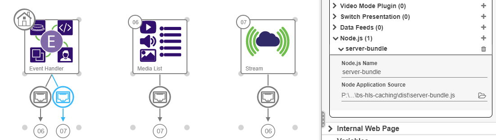

## Overview

This is a technical demo that sets a BrightSign player up to connect to an HLS audio livestream, and if the stream URL becomes unavailable, the player will fall back to a Media List of MP3 files. This local playback leverages a BA:con Presentation (likely with Content Cloud) The player will continue to monitor the stream URL and if it becomes available again, it will reconnect automatically. This switching is accomplished via UDP Events that come from the Express server running on the player.

## Limitations

This is currently built with very basic building blocks and is incomplete. In its current state, the basic "fallback" functionality is the primary feature.

Not yet considered:

- The local playback mode is logging the playback on the player, and these logs need to be retrieved
- How to package and provision to a player

## Install

Open project in code editor and install packages: npm install

Edit the "proxy-server.js" file for the variable "livestreamUrl". Point this to an audio HLS stream URL of your choosing.

Webpack: npx webpack

Open HLS Music Server.bpfx Presentation in BrightAuthor:connected and link pathing for the Support Content / Node.js file "server-bundle.js". This should point to your "dist/server-bundle.js" file.

Add MP3 files to the MediaList Widget.

Publish Presentation to a player.
